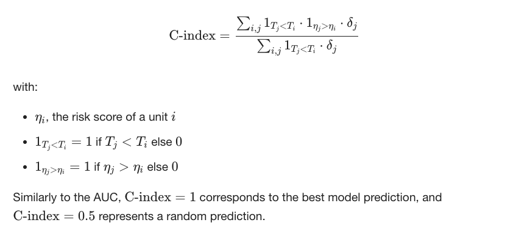

# 1. Intro
1. **대회 취지** 
 `CIBMTR - Equity in post-HCT Survival Predictions` 대회는 조혈모세포(HCT)를 모든 환자가 배경에 상관없이 공평하게 이식받을 수 있도록, 환자의 생존확률을 더 정확히 예측하는 것을 목표로 함.  
 특히 현재의 예측 모델들은 종종 사회경제적 지위, 인종, 지리적 위치와 관련된 차이를 해결하지 못하는 바, 이러한 격차를 해결하는 것이 환자 치료의 향상, 자원 활용의 최적화, 의료 시스템에 대한 신뢰 회복을 위해 매우 중요하다.

2. **평가지표** 
`Stratified Concordance Index(C-index)`라는 특별한 지표를 사용하여 다양한 환자 집단, 특히 이식 결과에 있어서의 인종 차이에 초점을 맞춰 모델의 예측 성능을 평가하는데 중점을 둔다. 
`C-index`가 1.0이면 완벽한 일치, 0.5는 무작위 예측, 0.0은 반대 일치를 의미한다. 
- 모든 인종 그룹에서 계산된 C-index 값을 평균을 내고
- 이 평균에서 각 인종 그룹별 C-index의 표준 편차를 뺀다.(인종 간 예측 성능의 일관성을 강조하기 위한 조치)
- 결과적으로 그룹 간 성능 차이가 적고 평균 성능이 높을 수록 좋은 점수를 얻게 됨.
  

3. **제출  파일 형식** 
테스트 데이터셋에 대한 예측을 실수 값의 위험 점수로 제출할 것.
- 형식: `ID,prediction` 
 예)  
`28800,0.5`, 
 `28801,1.2`
  - `ID`: 각 환자의 식별자
  - `prediction`: 모델이 생성한 해당 환자의 위험 점수 

4. **주의사항** 
    단순 분류, 회귀만 해봐서 이런 종류의 대회를 파악하기 까지 시간이 걸렸습니다. 
    본 대회는 efs(event 발생 여부), efs_time(event 발생 전까지 걸린 시간) 각각을 예측하는 것이 아니라, 그 둘을 조합하여 `위험 점수` 라는 것을 만들어서 해당 점수를 예측해야하는 것을 목표로 합니다. (예시: `KaplanMeierFitter`)  
    그리고 `C-index` 라는 평가지표를 사용하는 바, 점수 그 자체가 아니라 점수를 통한 target들의 `순서` 가 중요합니다. 
    또한, 위에 기술한 바 예측 모델이 환자들의 `순서`를 매김에 있어서 인종간에 성능의 차이가 적을수록 좋습니다. 
      
---

# 2. Feature 설명
1. **dri_score**:
   - **설명(Description)**: 질병 위험 지수 (Refined disease risk index)
   - **유형(Type)**: 범주형 (Categorical)
   - **값(Values)**: `Intermediate`, `High`, `N/A - non-malignant indication`, `N/A - pediatric`, `High - TED AML case <missing cytogenetics`, `TBD cytogenetics`, `Low`, `Intermediate - TED AML case <missing cytogenetics`, `N/A - disease not classifiable`, `nan`, `Very high`, `Missing disease status`

2. **psych_disturb**:
   - **설명(Description)**: 정신적 장애 (Psychiatric disturbance)
   - **유형(Type)**: 범주형 (Categorical)
   - **값(Values)**: `Yes`, `No`, `nan`, `Not done`

3. **cyto_score**:
   - **설명(Description)**: 세포유전학 점수 (Cytogenetic score)
   - **유형(Type)**: 범주형 (Categorical)
   - **값(Values)**: `Intermediate`, `Favorable`, `Poor`, `TBD`, `nan`, `Normal`, `Other`, `Not tested`

4. **diabetes**:
   - **설명(Description)**: 당뇨병 (Diabetes)
   - **유형(Type)**: 범주형 (Categorical)
   - **값(Values)**: `No`, `Yes`, `nan`, `Not done`

5. **hla_match_c_high**:
   - **설명(Description)**: 수혜자/제1 기증자 HLA-C 고해상도 맞춤 수준 (Recipient / 1st donor allele level (high resolution) matching at HLA-C)
   - **유형(Type)**: 수치형 (Numerical)

6. **hla_high_res_8**:
   - **설명(Description)**: 수혜자/제1 기증자 HLA-A,-B,-C,-DRB1 고해상도 맞춤 (Recipient / 1st donor allele-level (high resolution) matching at HLA-A,-B,-C,-DRB1)
   - **유형(Type)**: 수치형 (Numerical)

7. **tbi_status**:
   - **설명(Description)**: TBI 상태 (TBI)
   - **유형(Type)**: 범주형 (Categorical)
   - **값(Values)**: `No TBI`, `TBI + Cy +- Other`, `TBI +- Other, <=cGy`, `TBI +- Other, >cGy`, `TBI +- Other, -cGy, single`, `TBI +- Other, unknown dose`, `TBI +- Other, -cGy, unknown dose`, `TBI +- Other, -cGy, fractionated`

8. **arrhythmia**:
   - **설명(Description)**: 부정맥 (Arrhythmia)
   - **유형(Type)**: 범주형 (Categorical)
   - **값(Values)**: `No`, `nan`, `Yes`, `Not done`

9. **hla_low_res_6**:
   - **설명(Description)**: 수혜자/제1 기증자 HLA-A,-B,-DRB1 저해상도 맞춤 (Recipient / 1st donor antigen-level (low resolution) matching at HLA-A,-B,-DRB1)
   - **유형(Type)**: 수치형 (Numerical)

10. **graft_type**:
    - **설명(Description)**: 이식 유형 (Graft type)
    - **유형(Type)**: 범주형 (Categorical)
    - **값(Values)**: `Peripheral blood`, `Bone marrow`

11. **vent_hist**:
    - **설명(Description)**: 기계적 환기 이력 (History of mechanical ventilation)
    - **유형(Type)**: 범주형 (Categorical)
    - **값(Values)**: `No`, `Yes`, `nan`

12. **renal_issue**:
    - **설명(Description)**: 중등도/중증 신장 문제 (Renal, moderate / severe)
    - **유형(Type)**: 범주형 (Categorical)
    - **값(Values)**: `No`, `nan`, `Yes`, `Not done`

13. **pulm_severe**:
    - **설명(Description)**: 중증 폐 문제 (Pulmonary, severe)
    - **유형(Type)**: 범주형 (Categorical)
    - **값(Values)**: `No`, `Yes`, `nan`, `Not done`

14. **prim_disease_hct**:
    - **설명(Description)**: HCT의 주요 질병 (Primary disease for HCT)
    - **유형(Type)**: 범주형 (Categorical)
    - **값(Values)**: `ALL`, `MPN`, `IPA`, `AML`, `MDS`, `Other acute leukemia`, `AI`, `SAA`, `IEA`, `NHL`, `PCD`, `IIS`, `HIS`, `Other leukemia`, `Solid tumor`, `IMD`, `HD`, `CML`

15. **hla_high_res_6**:
    - **설명(Description)**: 수혜자/제1 기증자 HLA-A,-B,-DRB1 고해상도 맞춤 (Recipient / 1st donor allele-level (high resolution) matching at HLA-A,-B,-DRB1)
    - **유형(Type)**: 수치형 (Numerical)

16. **cmv_status**:
    - **설명(Description)**: 기증자/수혜자 CMV 혈청 상태 (Donor/recipient CMV serostatus)
    - **유형(Type)**: 범주형 (Categorical)
    - **값(Values)**: `+/-`, `+/+`, `-/-`, `-/+`, `nan`

17. **hla_high_res_10**:
    - **설명(Description)**: 수혜자/제1 기증자 HLA-A,-B,-C,-DRB1,-DQB1 고해상도 맞춤 (Recipient / 1st donor allele-level (high resolution) matching at HLA-A,-B,-C,-DRB1,-DQB1)
    - **유형(Type)**: 수치형 (Numerical)

18. **hla_match_dqb1_high**:
    - **설명(Description)**: 수혜자/제1 기증자 HLA-DQB1 고해상도 맞춤 수준 (Recipient / 1st donor allele level (high resolution) matching at HLA-DQB1)
    - **유형(Type)**: 수치형 (Numerical)

19. **tce_imm_match**:
    - **설명(Description)**: T-세포 에피토프 면역원성/다양성 맞춤 (T-cell epitope immunogenicity/diversity match)
    - **유형(Type)**: 범주형 (Categorical)
    - **값(Values)**: `P/P`, `nan`, `G/G`, `H/H`, `G/B`, `H/B`, `P/H`, `P/G`, `P/B`

20. **hla_nmdp_6**:
    - **설명(Description)**: 수혜자/제1 기증자 HLA-A(lo),-B(lo),-DRB1(hi) 맞춤 (Recipient / 1st donor matching at HLA-A(lo),-B(lo),-DRB1(hi))
    - **유형(Type)**: 수치형 (Numerical)

21. **hla_match_c_low**:
    - **설명(Description)**: 수혜자/제1 기증자 HLA-C 저해상도 맞춤 (Recipient / 1st donor antigen level (low resolution) matching at HLA-C)
    - **유형(Type)**: 수치형 (Numerical)

22. **rituximab**:
    - **설명(Description)**: 리툭시맙이 조건화에 사용됨 (Rituximab given in conditioning)
    - **유형(Type)**: 범주형 (Categorical)
    - **값(Values)**: `No`, `Yes`, `nan`

23. **hla_match_drb1_low**:
    - **설명(Description)**: 수혜자/제1 기증자 HLA-DRB1 저해상도 맞춤 (Recipient / 1st donor antigen level (low resolution) matching at HLA-DRB1)
    - **유형(Type)**: 수치형 (Numerical)

24. **hla_match_dqb1_low**:
    - **설명(Description)**: 수혜자/제1 기증자 HLA-DQB1 저해상도 맞춤 (Recipient / 1st donor antigen level (low resolution) matching at HLA-DQB1)
    - **유형(Type)**: 수치형 (Numerical)

25. **prod_type**:
    - **설명(Description)**: 제품 유형 (Product type)
    - **유형(Type)**: 범주형 (Categorical)
    - **값(Values)**: `PB`, `BM`

26. **cyto_score_detail**:
    - **설명(Description)**: 세포유전학 세부사항 (AML/MDS의 DRI) (Cytogenetics for DRI (AML/MDS))
    - **유형(Type)**: 범주형 (Categorical)
    - **값(Values)**: `Intermediate`, `nan`, `TBD`, `Favorable`, `Poor`, `Not tested`

27. **conditioning_intensity**:
    - **설명(Description)**: 계획된 조건화 강도 (Computed planned conditioning intensity)
    - **유형(Type)**: 범주형 (Categorical)
    - **값(Values)**: `RIC`, `nan`, `NMA`, `MAC`, `TBD`, `No drugs reported`, `N/A, F(pre-TED) not submitted`

28. **ethnicity**:
    - **설명(Description)**: 민족 (Ethnicity)
    - **유형(Type)**: 범주형 (Categorical)
    - **값(Values)**: `Not Hispanic or Latino`, `Hispanic or Latino`, `nan`, `Non-resident of the U.S.`

29. **year_hct**:
    - **설명(Description)**: HCT 시행 연도 (Year of HCT)
    - **유형(Type)**: 수치형 (Numerical)

30. **obesity**:
    - **설명(Description)**: 비만 (Obesity)
    - **유형(Type)**: 범주형 (Categorical)
    - **값(Values)**: `No`, `Yes`, `nan`, `Not done`

31. **mrd_hct**:
    - **설명(Description)**: HCT 시점의 MRD (AML/ALL) (MRD at time of HCT (AML/ALL))
    - **유형(Type)**: 범주형 (Categorical)
    - **값(Values)**: `nan`, `Negative`, `Positive`

32. **in_vivo_tcd**:
    - **설명(Description)**: 생체 내 T세포 고갈 (ATG/알렘투주맙) (In-vivo T-cell depletion (ATG/alemtuzumab))
    - **유형(Type)**: 범주형 (Categorical)
    - **값(Values)**: `Yes`, `No`, `nan`

33. **tce_match**:
    - **설명(Description)**: T-세포 에피토프 맞춤 (T-cell epitope matching)
    - **유형(Type)**: 범주형 (Categorical)
    - **값(Values)**: `Permissive`, `Fully matched`, `nan`, `GvH non-permissive`, `HvG non-permissive`

34. **hla_match_a_high**:
    - **설명(Description)**: 수혜자/제1 기증자 HLA-A 고해상도 맞춤 수준 (Recipient / 1st donor allele level (high resolution) matching at HLA-A)
    - **유형(Type)**: 수치형 (Numerical)

35. **hepatic_severe**:
    - **설명(Description)**: 중등도/중증 간 문제 (Hepatic, moderate / severe)
    - **유형(Type)**: 범주형 (Categorical)
    - **값(Values)**: `No`, `nan`, `Yes`, `Not done`

36. **donor_age**:
    - **설명(Description)**: 기증자 나이 (Donor age)
    - **유형(Type)**: 수치형 (Numerical)

37. **prior_tumor**:
    - **설명(Description)**: 이전 고형 종양 (Solid tumor, prior)
    - **유형(Type)**: 범주형 (Categorical)
    - **값(Values)**: `Yes`, `No`, `nan`, `Not done`

38. **hla_match_b_low**:
    - **설명(Description)**: 수혜자/제1 기증자 HLA-B 저해상도 맞춤 (Recipient / 1st donor antigen level (low resolution) matching at HLA-B)
    - **유형(Type)**: 수치형 (Numerical)

39. **peptic_ulcer**:
    - **설명(Description)**: 소화성 궤양 (Peptic ulcer)
    - **유형(Type)**: 범주형 (Categorical)
    - **값(Values)**: `No`, `nan`, `Yes`, `Not done`

40. **age_at_hct**:
    - **설명(Description)**: HCT 시 연령 (Age at HCT)
    - **유형(Type)**: 수치형 (Numerical)

41. **hla_match_a_low**:
    - **설명(Description)**: 수혜자/제1 기증자 HLA-A 저해상도 맞춤 (Recipient / 1st donor antigen level (low resolution) matching at HLA-A)
    - **유형(Type)**: 수치형 (Numerical)

42. **gvhd_proph**:
    - **설명(Description)**: 계획된 GVHD 예방 (Planned GVHD prophylaxis)
    - **유형(Type)**: 범주형 (Categorical)
    - **값(Values)**: `FK+ MMF +- others`, `Parent Q = yes, but no agent`, `nan`, `FK+ MTX +- others(not MMF)`, `FKalone`, `Cyclophosphamide alone`, `CSA + MMF +- others(not FK)`, `TDEPLETION +- other`, `Cyclophosphamide +- others`, `No GvHD Prophylaxis`, `Other GVHD Prophylaxis`, `CSA alone`, `TDEPLETION alone`, `CDselect alone`, `CSA + MTX +- others(not FMMF,FK)`, `FK+- others(not MMF,MTX)`, `CDselect +- other`, `CSA +- others(not FK,MMF,MTX)`

43. **rheum_issue**:
    - **설명(Description)**: 류마티스 문제 (Rheumatologic)
    - **유형(Type)**: 범주형 (Categorical)
    - **값(Values)**: `No`, `nan`, `Yes`, `Not done`

44. **sex_match**:
    - **설명(Description)**: 기증자/수혜자 성별 맞춤 (Donor/recipient sex match)
    - **유형(Type)**: 범주형 (Categorical)
    - **값(Values)**: `M-M`, `F-F`, `F-M`, `M-F`, `nan`

45. **hla_match_b_high**:
    - **설명(Description)**: 수혜자/제1 기증자 HLA-B 고해상도 맞춤 수준 (Recipient / 1st donor allele level (high resolution) matching at HLA-B)
    - **유형(Type)**: 수치형 (Numerical)

46. **race_group**:
    - **설명(Description)**: 인종 (Race)
    - **유형(Type)**: 범주형 (Categorical)
    - **값(Values)**: `White`, `Black or African-American`, `Native Hawaiian or other Pacific Islander`, `Asian`, `American Indian or Alaska Native`, `More than one race`

47. **comorbidity_score**:
    - **설명(Description)**: Sorror 동반질환 점수 (Sorror comorbidity score)
    - **유형(Type)**: 수치형 (Numerical)

48. **karnofsky_score**:
    - **설명(Description)**: HCT 시 Karnofsky 수행 상태(KPS) 점수 (KPS at HCT)
    - **유형(Type)**: 수치형 (Numerical)

49. **hepatic_mild**:
    - **설명(Description)**: 경증 간 문제 (Hepatic, mild)
    - **유형(Type)**: 범주형 (Categorical)
    - **값(Values)**: `No`, `Yes`, `nan`, `Not done`

50. **tce_div_match**:
    - **설명(Description)**: T-세포 에피토프 다양성 맞춤 (T-cell epitope matching)
    - **유형(Type)**: 범주형 (Categorical)
    - **값(Values)**: `Permissive mismatched`, `Bi-directional non-permissive`, `nan`, `GvH non-permissive`, `HvG non-permissive`

51. **donor_related**:
    - **설명(Description)**: 관련 기증자 대 비관련 기증자 (Related vs. unrelated donor)
    - **유형(Type)**: 범주형 (Categorical)
    - **값(Values)**: `Unrelated`, `Related`, `Multiple donor (non-UCB)`, `nan`

52. **melphalan_dose**:
    - **설명(Description)**: 멜팔란 용량 (mg/m^2) (Melphalan dose (mg/m^2))
    - **유형(Type)**: 범주형 (Categorical)
    - **값(Values)**: `N/A, Mel not given`, `MEL`, `nan`

53. **hla_low_res_8**:
    - **설명(Description)**: 수혜자/제1 기증자 HLA-A,-B,-C,-DRB1 저해상도 맞춤 (Recipient / 1st donor antigen-level (low resolution) matching at HLA-A,-B,-C,-DRB1)
    - **유형(Type)**: 수치형 (Numerical)

54. **cardiac**:
    - **설명(Description)**: 심장 문제 (Cardiac)
    - **유형(Type)**: 범주형 (Categorical)
    - **값(Values)**: `No`, `Yes`, `nan`, `Not done`

55. **hla_match_drb1_high**:
    - **설명(Description)**: 수혜자/제1 기증자 HLA-DRB1 고해상도 맞춤 수준 (Recipient / 1st donor allele level (high resolution) matching at HLA-DRB1)
    - **유형(Type)**: 수치형 (Numerical)

56. **pulm_moderate**:
    - **설명(Description)**: 중등도 폐 문제 (Pulmonary, moderate)
    - **유형(Type)**: 범주형 (Categorical)
    - **값(Values)**: `Yes`, `Not done`, `No`, `nan`

57. **hla_low_res_10**:
    - **설명(Description)**: HLA-A,-B,-C,-DRB1 나열 없이 참조됨 (값만 있음, 설명 없음)

58. **efs**:
    - **설명(Description)**: 이벤트 없는 생존 (Event-free survival)
    - **유형(Type)**: 범주형 (Categorical)
    - **값(Values)**: `Event`, `Censoring`

59. **efs_time**:
    - **설명(Description)**: 이벤트 없는 생존 시간 (개월) (Time to event-free survival, months)
    - **유형(Type)**: 수치형 (Numerical)

---

# 3. How to use (conda 기준)
- `conda create -n inference python==3.11`
- `git clone https://github.com/hskhyl/CIBMTR-HCT-Prediction.git`
- `make setup`
- `python3 main.py`
